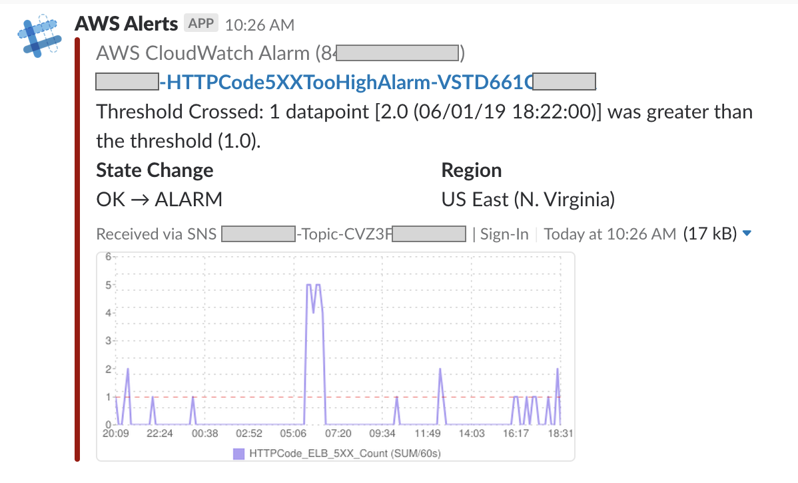

# AWS-to-Slack

[](https://www.npmjs.com/package/aws-to-slack)
[](https://github.com/arabold/aws-to-slack/blob/master/LICENSE)
[](https://www.npmjs.com/package/aws-to-slack)


Forward AWS CloudWatch Alarms and other notifications from Amazon SNS to Slack.

<table>
   <tr>
      <th>CloudWatch Example</th>
      <th>EB Event Example</th>
   </tr>
   <tr>
      <td width="50%"></td>
      <td></td>
   </tr>
</table>

## What is it?
_AWS-to-Slack_ is a Lambda function written in Node.js that forwards alarms and
notifications to a dedicated [Slack](https://slack.com) channel. It is self-hosted
in your own AWS environment and doesn't have any 3rd party dependencies other
than the Google Charts API for rendering CloudWatch metrics.

Supported AWS product notification formats:
* Auto-Scaling Events
* Batch Events
* CloudFormation
* CloudWatch Alarms *(incl. Metrics!)*
* CodeBuild
* CodeCommit
* CodeDeploy 🆕 _(via SNS/CloudWatch)_
* CodePipeline 🆕 _(via SNS/CloudWatch)_
* CodePipeline Manual Approval 🆕
* Elastic Beanstalk
* Event-bridge (AWS Config Compliance Change, Remediation Execution Status Change, Remediation Execution Failures) 🆕
* GuardDuty 🆕
* Health Dashboard
* Inspector
* RDS
* SES Received Notifications
* Generic SNS messages
* Plain text messages

Additional formats will be added. Pull Requests are welcome!

## Deployment Pre-requisites.
1. Slack incoming webhook configured to forward incoming messages to Slack channel.
2. A Slack Channel which receives notifications from Step 1.


## Creating and Configuring Slack App
1. Go to : https://api.slack.com/apps/, sign into your workspace and Click "Create New App". 


2. On next prompt, Click Create App from Scratch. You can also create an App from a Manifest file. This document guides you how to create from scratch. 


3. Pick App Name and select Workspace as home to your app. Then Click Create App.  
Note: Your workspace may require apps to be approved by admins. Once you have created your App, request approval from your workspace admin to install it to your workspace. 

4. Once your app is created, you will be shown a Settings screen with information relevant to your newly created App. Provide name and description, and leave all other fields as they are. Click Save Changes. 


5. Next you will need to configure incoming webhooks. To do that, from the Options in the left pane, under Features,   Click Incoming Webhooks and Click Activate Incoming Webhooks.


6. Next you may need to get Approval to Request Incoming Webhooks.  This is required for your Application to receive messages, and relay to your designated Slack Channel. Click Request Incoming Webhooks, and request your admin for approval. 


7. Once Approved, go back to Incoming Webhooks. Specify the Slack Channel where you want the Incoming messages to be Posted. 


8. **The webhook contains parts of your credential information. Hence this should be considered as a sensitive information and stored accordingly. Anyone with this Webhook Url can post Messages to it.**

   
## Creating SNS Topic, Eventbridge Rules, and required Roles.
1. Go to your Management/Audit/Security AWS account from where you wish to deploy the SNS Topic, Eventbridge Rules and required IAM role.
2. Grab the Cloudformation template under eventbridge directory, and deploy it as StackSet. This template requires parameters below:
   i. DeployAllWSConfigComplianceChangesRule (Boolean). Controls creation of Eventbridge rule to detect all Compliance Changes. Default = true.
  ii. DeployAWSConfigNonComplianceAlertRule: Controls creation of Eventbridge rule to only when resources become non-Compliant. Default = true. 
  iii. Controls creation of Eventbridge rule to detect Failures of Remediation Actions. Default = true.
  iv. ManagementAccountId. Mandatory Parameter for AWS Account ID where you manage the StackSet. The Lambda Function that Subscribes to the SNS topic is also created in this account. Steps to deploy lambda are described in next Section.
  v. RemediationTopicName. SNS Topic.


## Try!
Ready to try the latest version for yourself? Installation into your own AWS environment is simple:

### Option 1: Quick Start (OLD CODE)

[](https://console.aws.amazon.com/cloudformation/home?region=us-east-1#/stacks/new?stackName=aws-to-slack)

*Warning!* The template referenced by this link is an old template and old code! If you want the latest version of this repo, you need to update the Lambda code after it's launched.
      
### Option 2: Get the latest bug fixes

1. Download this repo locally.

1. Use AWS Console's [Create CloudFormation Stack](https://console.aws.amazon.com/cloudformation/home?region=us-east-1#/stacks/new?stackName=aws-to-slack) tool.

   Upload [cloudformation.yaml](https://raw.githubusercontent.com/arabold/aws-to-slack/master/cloudformation.yaml) as your template.

1. Finish launching the Stack.

   For details on the parameter values, see [Installation](#installation) section. 

1. Build / Update the code by running the following from the root of this project:
   ```
   AWS_REGION="<your_lambda_region>" LAMBDA_NAME="<your_lambda_name>" make deploy
   ```  

   If you use AWS CLI profiles, simply add `AWS_PROFILE` to the make command like so:
   ```
   AWS_PROFILE="my-profile" AWS_REGION="<your_lambda_region>" LAMBDA_NAME="<your_lambda_name>" make deploy
   ```

### Option 3: Use deploy target

See [Managing Multiple Deployments](#managing-multiple-deployments) for a `.env` file approach to creating or managing multiple stacks.

## Installation

### Step 1: Setup Slack
The Lambda function communicates with Slack through a Slack webhook
[webhook](https://my.slack.com/apps/manage). Note that you can either create an app, or a custom integration > Incoming webhook (easier, will only let you add a webhook)
*Warning!* (Updated: 05 March 2023) Slack Recommends using Slack Apps instead of custom integrations, to enable use of latest features and APIs  


1. Navigate to https://my.slack.com/apps/manage and click
   "Add Configuration".
2. Choose the default channel where messages will be sent and click
   "Add Incoming WebHooks Integration".
3. Copy the webhook URL from the setup instructions and use it in the next
   section.
4. Click "Save Settings" at the bottom of the Slack integration page.


### Step 2: Configure & Launch the CloudFormation Stack

Note that the AWS region will be the region from which you launch the CloudFormation wizard, which will also scope the resources (SNS, etc.) to that region. 

Launch the CloudFormation Stack by using our preconfigured CloudFormation
[template](https://raw.githubusercontent.com/arabold/aws-to-slack/master/cloudformation.yaml) and following the [steps above](#try).

**Afterwards**

Click "Next" and on the following page name your new stack and paste the
webhook URL from before into the "HookUrl" field. You can also configure a
different channel to post to if wanted.


Click "Next" again, complete the stack setup on the following pages and
finally launch your stack.

### Step 3: Subscribe to Triggers

Before the Lambda function will actually do anything you need to subscribe it
to actual CloudWatch alarms and other SNS triggers. Open up the AWS Lambda,
switch to the "Triggers" tab and subscribe for all events you're interested in.


### Setting Up AWS CodeBuild
CodeBuild integration was suggested by [ericcj](https://github.com/ericcj) and is based on
the Medium post [Monitor your AWS CodeBuilds via Lambda and Slack](https://hackernoon.com/monitor-your-aws-codebuilds-via-lambda-and-slack-ae2c621f68f1) by
Randy Findley. 

To enable CodeBuild notifications add a new _CloudWatch Event Rule_, choose _CodeBuild_
as source and _CodeBuild Build State Change_ as type. As Target select the `aws-to-slack`
Lambda. You can leave all other settings as is. Once your rule is created all CodeBuild
build state events will be forwarded to your Slack channel.

### Setting Up AWS CodeCommit

Similar to the CodeBuild integration, CodeCommit notifications are triggered by
CloudWatch Event Rules. Create a new CloudWatch Event Rule, select _CodeCommit_
as the source, and select one of the supported event types:

* _CodeCommit Pull Request State Change_ - Will generate events when a pull
  request is opened, closed, merged, or updated.
* _CodeCommit Repository State Change_ - Will generate events when a branch
  or tag reference is created, updated, or deleted.

Add the `aws-to-slack` lambda as the target. No other settings are needed.

## Managing Multiple Deployments

You can save local `.env` files that contain your stack configurations for easier deployment and updates.  Copy `targets/example.env` to a separate file and customize the parameters.  Then deploy the file like this:

```bash
TARGET=targets/my-deploy.env make deploy
```

If you want to force-compile this project and push your code to a stack, use this:
```bash
TARGET=targets/my-deploy.env make package deploy
```

If you need to update your CloudFormation parameters, try this:
```bash
TARGET=targets/my-deploy.env make update-stack
```

## Contributing

You want to contribute? That's awesome! 🎉

Check out our [issues page](https://github.com/arabold/aws-to-slack/issues) for
some ideas how to contribute and a list of open tasks. There're plenty of
notification formats that still need to be supported.

The repository comes with a very simple `Makefile` to build the CloudFormation
stack yourself. 

```bash
make package
```

This generates a new `release.zip` in the root folder. Upload this zip to your
AWS Lambda function and you're good to go. Make sure to check out [Managing Multiple Deployments](#managing-multiple-deployments) for a more scalable solution to deploys.
